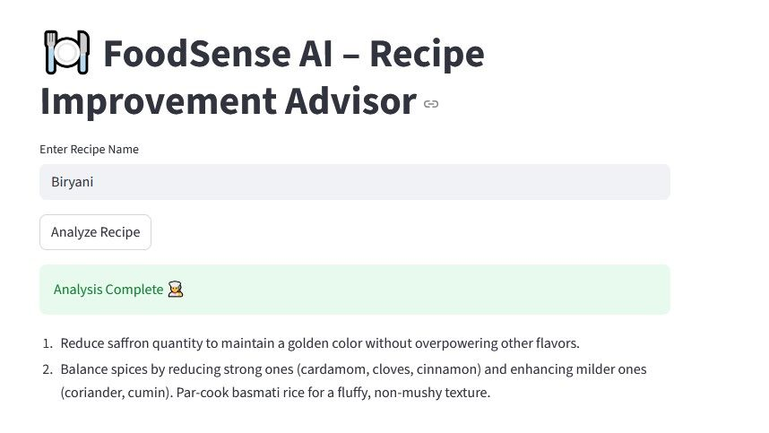
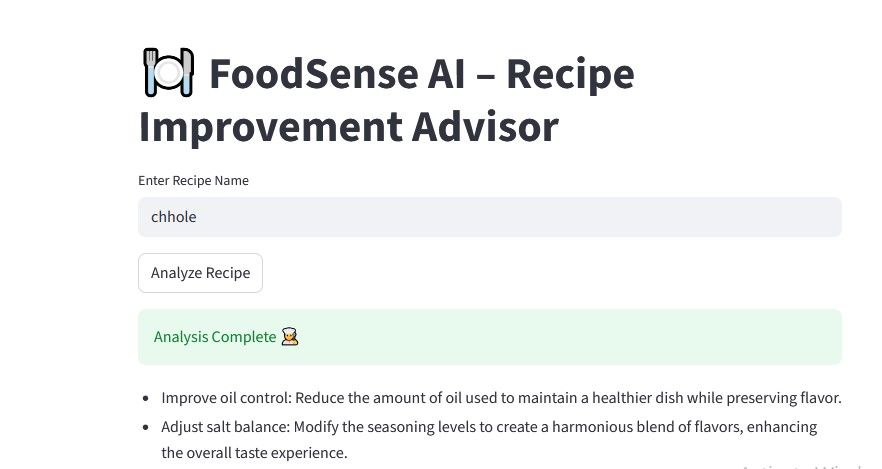

#  FoodSense AI — Recipe Improvement Advisor

FoodSense AI is an intelligent multi-agent system that analyzes unstructured food reviews and generates actionable recipe improvement insights using AI, Machine Learning, NLP, and LLM-based reasoning.

This project demonstrates how modern AI agents can collaborate to transform raw customer feedback into meaningful recommendations for chefs, restaurants, and food product teams.

---

##  Project Overview

FoodSense AI processes customer review data and performs:

* Review Summarization
* Sentiment Analysis
* Issue Identification
* Recommendation Generation

The system uses a **multi-agent workflow** built with LangGraph, where specialized agents handle different analytical tasks and collaborate to produce a final improvement report.

---


##  Key Features

✅ Multi-Agent Architecture
✅ NLP-based Review Understanding
✅ LLM Prompt Engineering
✅ Automated Insight Generation
✅ Modular and Scalable Workflow Design

---

##  Architecture

The workflow is divided into multiple agents:

* **Review Analyzer Agent** — Understands customer feedback
* **Sentiment Agent** — Detects positive/negative sentiment
* **Advisor Agent** — Suggests improvements
* **Reporter Agent** — Generates final structured output

Each agent performs a specific task and passes results through a graph-based pipeline.

---

##  Tech Stack

* Python -- Backend Logic
* Pandas -- Data Preprocessing
* Streamlit -- Web Interface
* Ollama -- Local LLM Runtime
* LangChain -- 	LLM Integration
* LangGraph -- 	Multi-Agent Workflow
* Mistral -- Language Model for Reasoning

---

##  Project Structure

```
agents/        → AI agents logic
graph/         → Workflow orchestration
utils/         → Data processing utilities
data/          → Dataset folder (not included in repo)
app.py         → Main application entry
main.py        → Execution script
```

---

##  Dataset Note

Large dataset files are **not uploaded** due to GitHub's 100MB file size limit.

Due to GitHub file size limits, datasets are not included in this repository.

Download datasets from the links provided in: data/dataset_links.txt After downloading, place the files inside the data folder before running the project.

##  Installation & Setup

Clone the repository:

```
git clone https://github.com/kshitijbhosale820/foodsense.git
cd foodsense
```

Create virtual environment:

```
python -m venv venv
venv\Scripts\activate
```

Install dependencies:

```
pip install -r requirements.txt
```
Install Ollama (for local LLM):

```
Download from: https://ollama.com
Then pull a model:
ollama run mistral
(You can also use a smaller model like phi)
Press Ctrl + C after the model loads.
```

---

##  Run the Project

```

Run the application

streamlit run app.py Open the browser link shown in the terminal.
```

---

##  Use Case

FoodSense AI helps businesses:

* Understand customer feedback at scale
* Identify recipe weaknesses
* Improve product quality using AI insights

---

##  Future Improvements

* Web UI dashboard
* Real-time streaming review analysis
* Model fine-tuning
* Deployment using cloud services

---

## 📸 Application Screenshots

### 🔍 Biryani Analysis Example


### 🍛 Chhole Analysis Example


---

